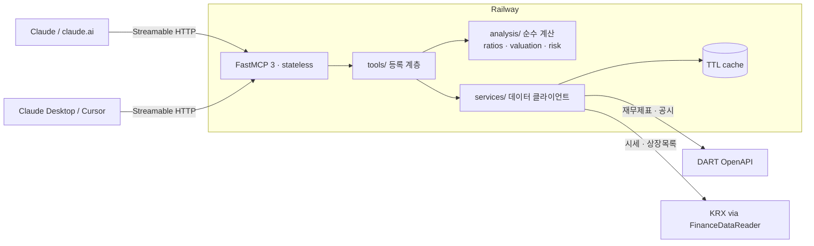

<div align="center">

# 📈 korea-stock-mcp

**한국 주식을 위한 보수적·데이터 정직 원격 MCP 서버**<br>
*Conservative, data-honest Korean equity analysis for Claude, Cursor and any MCP client*

[](https://github.com/Mrbaeksang/korea-stock-analyzer-mcp/actions)
[](https://www.python.org)
[](https://gofastmcp.com)
[](https://modelcontextprotocol.io)
[](LICENSE)

</div>

---

> DART 전자공시의 **실측 재무제표**와 KRX 시세만으로 한국 상장사를 분석한다.
> 데이터가 없으면 없다고 답하고, 목표 주가 대신 가정이 명시된 **범위**를 제시하며, 매수·매도 권고를 하지 않는다.

## ✨ Features

- **날조 제로** — 모든 수치는 DART 공시·KRX 시세 실측치. 결측은 `null` + 사유로 명시, 기본값 주입 없음
- **실측 재무제표** — 사업보고서 기반 매출·영업이익·현금흐름 3~10개년, 연결(CFS) 우선/별도(OFS) 폴백 표시
- **보수적 밸류에이션** — 단일 적정가 대신 3시나리오(비관/중립/낙관) 범위, 성장률·멀티플 가정 전부 응답에 포함
- **리스크 우선** — 재무 적신호 6종 자동 검사 + 공시 위험 키워드 하이라이트, 검사 불가 항목도 구분 보고
- **교차 검증** — 시가총액 정합성 검사(주가×주식수 vs 보고 시총) 등 데이터 정합성 검증 내장
- **운영 기본기** — 글로벌 레이트 리밋, DART 쿼터 보호 캐싱, KRX IP 차단 방지 직렬화, 구조화 에러 메시지

## 🏗️ Architecture



계층 원칙: `tools/`는 등록만(얇게) → `services/`는 외부 API + 캐싱 → `analysis/`는 순수함수(가장 두꺼운 테스트). LLM도 서버도 수치를 "암산"하지 않는다 — 모든 계산은 결정론적 함수다.

## 🚀 Quickstart

배포된 서버 URL 하나면 된다. API 키 불필요(공개 데이터만 제공).

**claude.ai** — 설정 → 커넥터 → 커스텀 커넥터 추가:

```
https://korea-stock-analyzer-mcp-production.up.railway.app/mcp
```

**Claude Code**:

```bash
claude mcp add --transport http korea-stock https://korea-stock-analyzer-mcp-production.up.railway.app/mcp
```

<details>
<summary><strong>Claude Desktop / Cursor</strong> (mcp.json)</summary>

```json
{
  "mcpServers": {
    "korea-stock": {
      "type": "http",
      "url": "https://korea-stock-analyzer-mcp-production.up.railway.app/mcp"
    }
  }
}
```

</details>

연결 후 이렇게 물어보면 된다:

> "삼성전자 최근 5년 재무제표 흐름이랑 리스크 요인 짚어줘"

## 🛠️ Tools

| 도구 | 설명 | 주요 파라미터 |
|---|---|---|
| `search_company` | 종목명/코드로 상장사 검색 (KOSPI·KOSDAQ) | `query` |
| `get_quote` | 시세·시가총액·52주 고저·거래량 + 시총 정합성 검사 | `ticker` |
| `get_financials` | 실측 연간 재무제표 + 수익성·안정성·성장성·현금흐름 비율 | `ticker`, `years` (2–10) |
| `get_valuation` | PER/PBR 멀티플 + 3시나리오 가치 범위 (가정 명시) | `ticker` |
| `get_risk_flags` | 재무 적신호 6종 + 최근 공시 위험 키워드 | `ticker`, `disclosure_days` |

모든 응답에 데이터 기준일(`as_of`)과 출처(`data_source`)가 붙는다.

## ☁️ Deploy Your Own

Railway 기준 (Dockerfile 자동 감지):

1. 이 레포를 포크 → Railway에서 GitHub 레포 연결
2. 환경변수:

| 변수 | 필수 | 설명 |
|---|---|---|
| `DART_API_KEY` | ✅ | [opendart.fss.or.kr](https://opendart.fss.or.kr) 무료 발급 (일 20,000건) |
| `FASTMCP_HTTP_ALLOWED_HOSTS` | ✅ | `["<서비스>.up.railway.app","healthcheck.railway.app"]` |
| `RATE_LIMIT_RPS` / `RATE_LIMIT_BURST` | — | 기본 5 / 15 |

3. Serverless(App Sleeping) **비활성** 권장 — 콜드 스타트 시 커넥터 연결 실패 방지

로컬 실행:

```bash
uv sync
DART_API_KEY=<key> uv run uvicorn app.main:app --app-dir src --port 8000
```

테스트:

```bash
uv run pytest                          # 단위·경계 테스트 (외부 API 없음)
uv run pytest -m live -o addopts=""    # 실제 KRX/DART 검증 (키 필요)
```

## 📊 데이터 출처와 한계

| 데이터 | 출처 | 한계 |
|---|---|---|
| 재무제표 | DART OpenAPI (사업보고서 XBRL) | 연간만, 분기 미제공 |
| 시세·시총 | KRX (FinanceDataReader) | 일별 스냅샷, 실시간 아님 |
| 공시 목록 | DART OpenAPI | 최근 7~365일 |
| FCF | 영업CF − 유형자산 취득 | **근사치** — 무형자산·리스 투자 미포함 |

## 🔒 Disclaimer

본 서버의 출력은 공시·시세 데이터의 산술 가공 결과이며 **투자 자문이 아니다**. 시나리오 값은 명시된 가정의 계산 결과일 뿐 목표 주가가 아니다. 서버는 매수·매도·비중 판단을 제공하지 않으며, 투자 판단과 책임은 전적으로 이용자에게 있다.

## 🤝 Contributing

이슈·PR 환영. 원칙 하나만 지켜달라: **데이터가 없으면 없다고 답한다.** 추정치 주입·하드코딩 폴백이 들어간 PR은 받지 않는다. 테스트는 `uv run pytest` 통과 필수.

## 📜 License

[Apache-2.0](LICENSE)
